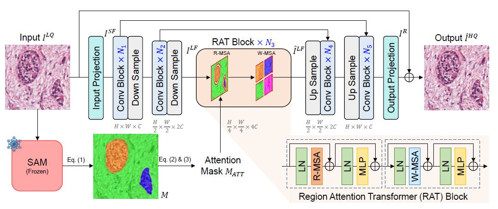
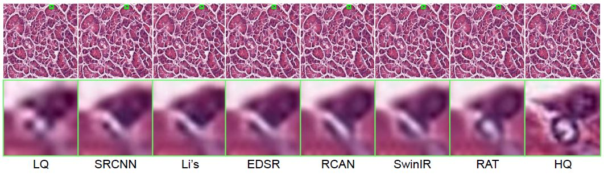
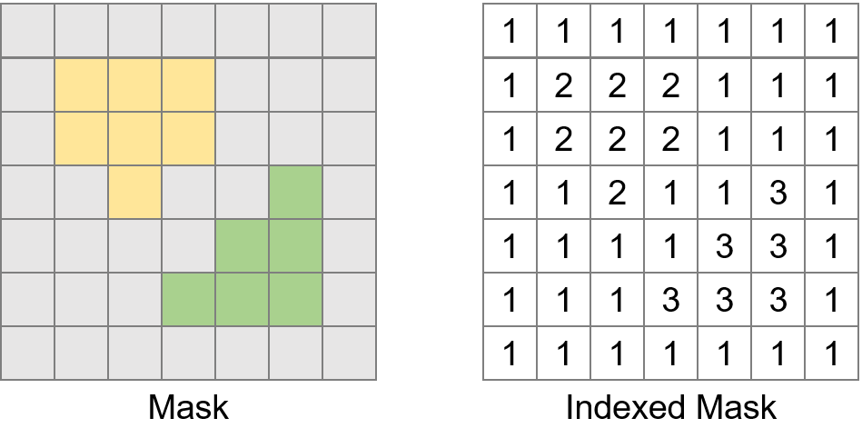

# Region Attention Transformer for Medical Image Restoration (RAT)

PyTorch implementation for Region Attention Transformer for Medical Image Restoration [](https://arxiv.org/abs/2407.09268) (MICCAI 2024).

## Network Architecture



## Visual Comparison



## Getting Started with Model Inference

RAT has two inputs: the **input image** and the **indexed mask** obtained from post-processing the SAM output mask. The example input image is located at “./example_img/input_img.png", and the resulting indexed mask can be found at “./example_img/indexed_mask.nii”.

Next, we will first explain how to obtain the indexed mask using SAM, followed by an introduction to the final model inference.

- **Mask Prediction & Postprocess**

  First, you can obtain region partitioning masks with the [Segment Anything Model](git@github.com:facebookresearch/segment-anything.git) (SAM) as follows:

  ```python
  from segment_anything import SamAutomaticMaskGenerator, sam_model_registry
  sam = sam_model_registry["<model_type>"](checkpoint = "<path/to/checkpoint>")
  mask_generator = SamAutomaticMaskGenerator(sam)
  masks = mask_generator.generate(<your_image>) 
  #<your_image> = "./example_img/input_img.png"
  ```

  Then, you need to post-process the masks to obtain an indexed mask, which can be then used for compact region partitioning during the downsampling process.

  ```python
  import numpy as np
  def toSegMap(masks): 
      result = np.zeros(masks[0]['segmentation'].shape)
      for i in range(len(masks)): 
          result[masks[i]['segmentation']] = (i+1) 
      result[result==0] = len(masks) + 1
      return result
  masks = sorted(masks, key = itemgetter('area'), reverse = True) 
  indexed_mask = toSegMap(masks) # Placed at "./example_img/indexed_mask.nii"
  ```

  The resultant indexed mask is available at "./example_img/indexed_mask.nii". You can use [AMIDE](https://amide.sourceforge.net/) or [ITK-SNAP](http://www.itksnap.org/pmwiki/pmwiki.php) softwares to visualize the ".nii" file. To facilitate understanding, a toy example of the indexed mask is displayed below:

  

- **RAT Inference**

  With the input image and its resultant indexed mask, the output of  RAT can be obtained as follows:

  ```python
  from Model_RAT import RAT
  model = RAT()
  output_img = model(input_img, indexed_mask) 
  # lr_img shape: [B, C, H, W] 
  # indexed_mask shape: [B, H, W]
  ```

## Citation

If you find RAT useful in your research, please consider citing:

```bibtex
@misc{yang2024rat,
      title={Region Attention Transformer for Medical Image Restoration}, 
      author={Zhiwen Yang and Haowei Chen and Ziniu Qian and Yang Zhou and Hui Zhang and Dan Zhao and Bingzheng Wei and Yan Xu},
      year={2024},
      eprint={2407.09268},
      archivePrefix={arXiv},
      primaryClass={cs.CV}
}
```

